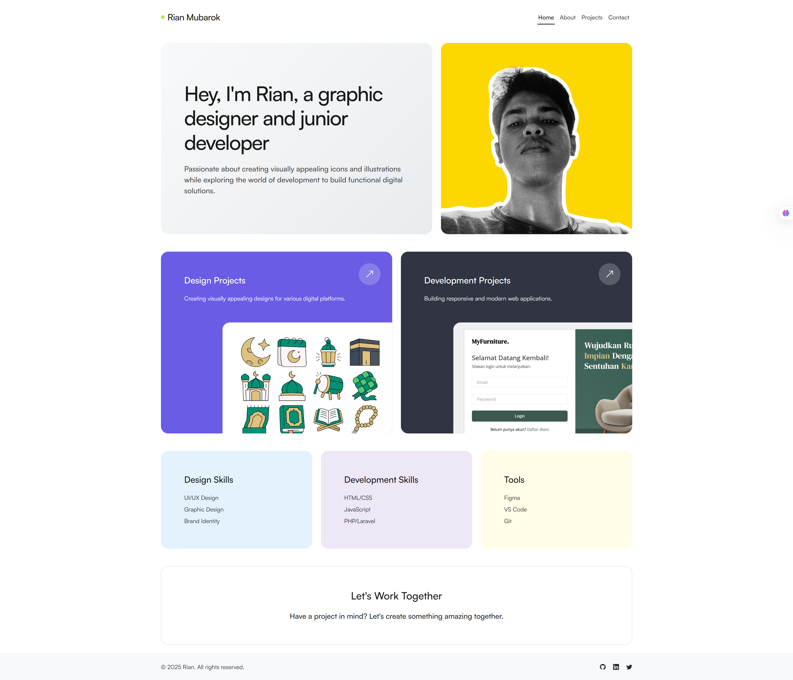
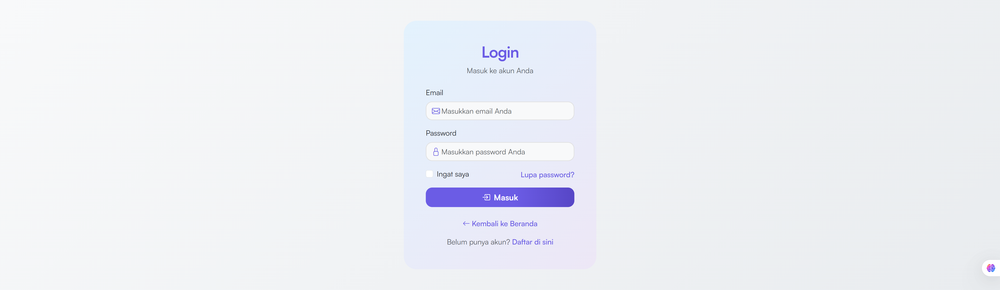
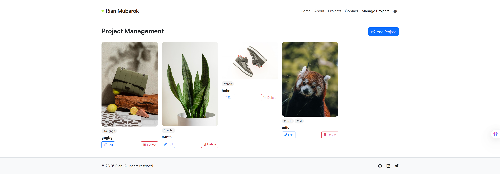
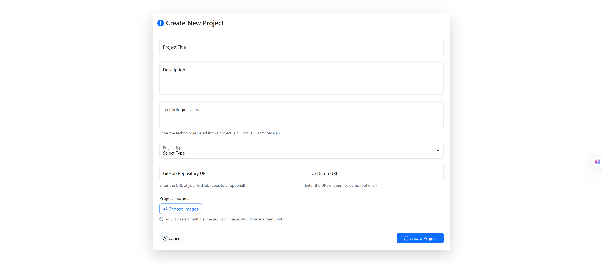
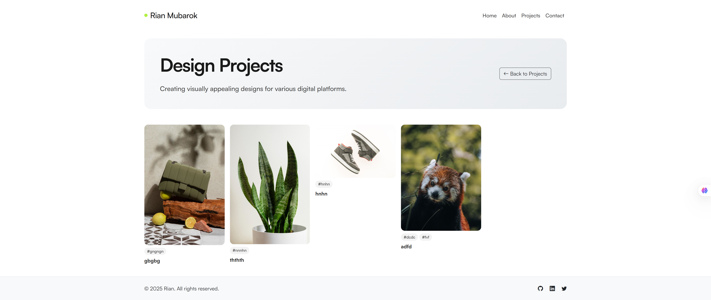

# Portfolio Web - Laravel Project

## Deskripsi Project

**Portfolio Web** adalah aplikasi web portfolio profesional yang dibangun menggunakan framework Laravel 12. Aplikasi ini dirancang untuk menampilkan karya-karya desain dan programming dengan sistem autentikasi multilevel yang memungkinkan administrator mengelola konten portfolio secara dinamis.

### Tujuan Project

-   Menampilkan portfolio profesional dengan desain modern dan responsif
-   Implementasi sistem autentikasi multilevel (Admin & User)
-   Manajemen konten portfolio yang dinamis
-   Upload dan optimasi gambar menggunakan Cloudinary
-   Interface yang user-friendly untuk admin dan pengunjung

---

## Screenshot Aplikasi

### **Homepage**



### **Login Page**



### **Admin Dashboard**



### **Project Management**



### **Project Gallery**



---

## Fitur Utama

### 🌐 **Fitur Publik (Public Features)**

-   **Homepage** - Halaman utama dengan introduksi dan preview project
-   **About** - Halaman tentang developer/designer
-   **Contact** - Halaman kontak
-   **Projects Gallery** - Galeri project dengan filter berdasarkan tipe (Design/Programming)
-   **Project Detail** - Halaman detail project dengan gambar dan informasi lengkap
-   **Responsive Design** - Tampilan yang responsif untuk semua device

### **Sistem Autentikasi & Authorization**

#### **Login & Authentication Multilevel**

Aplikasi ini mengimplementasikan sistem autentikasi multilevel dengan 2 level akses:

##### **1. Level Admin (Administrator)**

-   **Akses Penuh:** Semua fitur aplikasi
-   **Fitur Khusus:**
    -   Manajemen Project (CRUD)
    -   Upload & Optimasi Gambar
    -   Reorder Gambar Project
    -   Test Upload Interface
    -   Dashboard Admin

##### **2. Level User (Regular User)**

-   **Akses Terbatas:** Hanya fitur publik
-   **Fitur:**
    -   Melihat portfolio
    -   Mengakses halaman publik
    -   Profile management

#### **Implementasi Teknis Authentication:**

```php
// Middleware CheckUserLevel.php
class CheckUserLevel
{
    public function handle(Request $request, Closure $next): Response
    {
        if (!Auth::check()) {
            return redirect()->route('home')->with('error', 'Silakan login terlebih dahulu.');
        }

        $user = Auth::user();

        if ($user->hasLevel('Admin')) {
            return $next($request);
        }

        if ($user->hasLevel('User')) {
            $adminOnlyRoutes = [
                'project-management.*',
                'test-upload.*'
            ];

            if (in_array($currentRoute, $adminOnlyRoutes)) {
                return redirect()->route('home')->with('error', 'Akses ditolak.');
            }
        }

        return $next($request);
    }
}
```

#### **Model User dengan Relasi Many-to-Many:**

```php
// User.php
class User extends Authenticatable
{
    public function levels()
    {
        return $this->belongsToMany(Level::class);
    }

    public function hasLevel($level)
    {
        return $this->levels->contains('name', $level);
    }
}
```

### **Project Management System**

-   **Create Project** - Form pembuatan project dengan upload multiple images
-   **Edit Project** - Edit project dan gambar
-   **Delete Project** - Hapus project beserta gambar dari Cloudinary
-   **Image Management** - Upload, delete, dan reorder gambar
-   **Project Categories** - Kategorisasi project (Design/Programming)

### **Image Management dengan Cloudinary**

-   **Upload Multiple Images** - Upload beberapa gambar sekaligus
-   **Image Optimization** - Optimasi otomatis menggunakan Cloudinary
-   **Drag & Drop Reorder** - Mengatur urutan gambar dengan drag & drop
-   **Secure Storage** - Penyimpanan aman di Cloudinary

---

## Teknologi yang Digunakan

### **Backend Framework**

-   **Laravel 12** - PHP Framework terbaru
-   **PHP 8.2+** - Bahasa pemrograman server-side

### **Frontend & UI**

-   **Bootstrap 5.3.2** - CSS Framework
-   **Bootstrap Icons** - Icon library
-   **Satoshi Font** - Custom typography
-   **Vite** - Build tool dan asset bundler

### **Database & Storage**

-   **MySQL/PostgreSQL** - Database management
-   **Cloudinary** - Cloud image storage dan optimization
-   **Eloquent ORM** - Database abstraction layer

### **Authentication & Security**

-   **Laravel Breeze** - Authentication scaffolding
-   **CSRF Protection** - Cross-site request forgery protection
-   **Password Hashing** - Secure password storage
-   **Session Management** - User session handling

### **Development Tools**

-   **Laravel Pail** - Log viewer
-   **Pest PHP** - Testing framework
-   **Laravel Pint** - Code styling
-   **Laravel Sail** - Docker development environment

---

## Struktur Database

### **Tabel Utama:**

#### **1. users**

```sql
- id (Primary Key)
- name (VARCHAR)
- email (VARCHAR, Unique)
- password (VARCHAR, Hashed)
- email_verified_at (TIMESTAMP)
- remember_token (VARCHAR)
- timestamps
```

#### **2. levels**

```sql
- id (Primary Key)
- name (VARCHAR) - 'Admin', 'User'
- description (TEXT)
- timestamps
```

#### **3. level_user (Pivot Table)**

```sql
- level_id (Foreign Key)
- user_id (Foreign Key)
```

#### **4. projects**

```sql
- id (Primary Key)
- title (VARCHAR)
- description (TEXT)
- type (ENUM: 'design', 'programming')
- technologies (TEXT)
- github_link (VARCHAR, Nullable)
- live_link (VARCHAR, Nullable)
- timestamps
```

#### **5. project_images**

```sql
- id (Primary Key)
- project_id (Foreign Key)
- image_url (VARCHAR)
- public_id (VARCHAR) - Cloudinary ID
- order (INTEGER)
- timestamps
```

---

## Instalasi & Setup

### **Prerequisites**

-   PHP 8.2 atau lebih tinggi
-   Composer
-   Node.js & NPM
-   MySQL/PostgreSQL
-   Cloudinary Account

### **Langkah Instalasi**

1. **Clone Repository**

```bash
git clone https://github.com/rianmubarok/porto_laravel.git>
cd portfolioweb
```

2. **Install Dependencies**

```bash
composer install
npm install
```

3. **Environment Setup**

```bash
cp .env.example .env
php artisan key:generate
```

4. **Database Configuration**

```bash
# Edit .env file dengan database credentials
DB_CONNECTION=mysql
DB_HOST=127.0.0.1
DB_PORT=3306
DB_DATABASE=portfolioweb
DB_USERNAME=root
DB_PASSWORD=
```

5. **Cloudinary Configuration**

```bash
# Edit .env file dengan Cloudinary credentials
CLOUDINARY_CLOUD_NAME=your_cloud_name
CLOUDINARY_API_KEY=your_api_key
CLOUDINARY_API_SECRET=your_api_secret
```

6. **Database Migration & Seeding**

```bash
php artisan migrate
php artisan db:seed --class=LevelSeeder
php artisan db:seed --class=ProductionUserSeeder
```

7. **Build Assets**

```bash
npm run build
```

8. **Start Development Server**

```bash
php artisan serve
```

---

## Login Credentials

### **Admin Account**

-   **Email:** admin@portfolioweb.com
-   **Password:** Admin123!
-   **Level:** Administrator
-   **Access:** Full access to all features

### **Regular User Account**

-   **Email:** user@portfolioweb.com
-   **Password:** User123!
-   **Level:** User
-   **Access:** Limited access to public features only

---

## Struktur Project

```
portfolioweb/
├── app/
│   ├── Http/
│   │   ├── Controllers/
│   │   │   ├── Auth/                    # Authentication Controllers
│   │   │   ├── PortfolioController.php  # Public Portfolio Controller
│   │   │   ├── ProjectManagementController.php # Admin Project Management
│   │   │   └── TestUploadController.php # Test Upload Interface
│   │   ├── Middleware/
│   │   │   └── CheckUserLevel.php       # Multilevel Authorization
│   │   └── Requests/
│   │       └── Auth/
│   │           └── LoginRequest.php     # Login Validation
│   ├── Models/
│   │   ├── User.php                     # User Model with Level Relations
│   │   ├── Level.php                    # Level Model
│   │   ├── Project.php                  # Project Model
│   │   └── ProjectImage.php             # Project Image Model
│   └── Providers/
├── database/
│   ├── migrations/                      # Database Migrations
│   └── seeders/
│       ├── LevelSeeder.php              # Level Data Seeder
│       ├── LevelUserSeeder.php          # User-Level Relations
│       └── ProductionUserSeeder.php     # Production Users
├── resources/
│   └── views/
│       ├── auth/                        # Authentication Views
│       ├── layouts/                     # Layout Templates
│       ├── project-management/          # Admin Project Management Views
│       └── components/                  # Reusable Components
├── routes/
│   ├── web.php                          # Web Routes
│   └── auth.php                         # Authentication Routes
└── public/
    └── images/                          # Static Images
```

---

## Keamanan & Best Practices

### **Authentication Security**

-   Password hashing menggunakan bcrypt
-   CSRF protection pada semua form
-   Rate limiting untuk login attempts
-   Session management yang aman
-   Middleware authorization untuk route protection

### **Data Protection**

-   Input validation dan sanitization
-   SQL injection prevention dengan Eloquent ORM
-   XSS protection dengan Blade templating
-   Secure file upload dengan validation

### **Cloudinary Security**

-   Secure API key management
-   Image optimization dan compression
-   Automatic format conversion
-   CDN delivery untuk performa optimal

---

## Deployment

### **Production Checklist**

-   [ ] Environment variables configured
-   [ ] Database migrations run
-   [ ] Assets compiled (`npm run build`)
-   [ ] Storage links created (`php artisan storage:link`)
-   [ ] Cache cleared (`php artisan config:cache`)
-   [ ] Queue workers configured (if using queues)

### **Recommended Hosting**

-   **Shared Hosting:** cPanel dengan PHP 8.2+
-   **VPS:** DigitalOcean, Linode, atau Vultr
-   **Cloud:** AWS, Google Cloud, atau Azure
-   **PaaS:** Heroku, Railway, atau Vercel

---

## Dokumentasi API

### **Authentication Endpoints**

```
POST /login          - User login
POST /logout         - User logout
GET  /register       - Registration form
POST /register       - User registration
```

### **Project Management Endpoints (Admin Only)**

```
GET    /ngeditdulu                    - Project list
GET    /ngeditdulu/create             - Create project form
POST   /ngeditdulu                    - Store new project
GET    /ngeditdulu/{id}/edit          - Edit project form
PUT    /ngeditdulu/{id}               - Update project
DELETE /ngeditdulu/{id}               - Delete project
DELETE /ngeditdulu/images/{id}        - Delete project image
POST   /ngeditdulu/images/reorder     - Reorder images
```

### **Public Endpoints**

```
GET /                 - Homepage
GET /about            - About page
GET /contact          - Contact page
GET /projects         - Projects gallery
GET /projects/{type}  - Projects by type
GET /project/{id}     - Project detail
```

---

## Kontribusi

### **Development Workflow**

1. Fork repository
2. Create feature branch (`git checkout -b feature/AmazingFeature`)
3. Commit changes (`git commit -m 'Add some AmazingFeature'`)
4. Push to branch (`git push origin feature/AmazingFeature`)
5. Open Pull Request

### **Coding Standards**

-   PSR-12 coding standards
-   Laravel Pint for code formatting
-   Meaningful commit messages
-   Comprehensive documentation

---

## Developer

**Nama:** Muhammad Fitrian Mubarok  
**NIM:** 231240001402
**Kelas:** DB  
**Mata Kuliah:** Pemrograman Web Lanjut  
**Dosen:** Harminto Mulyo, S.Kom. M.Kom.

---

_Project ini masih dalam tahap pengembangan ⚙️_
